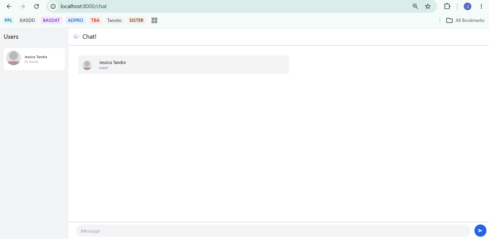
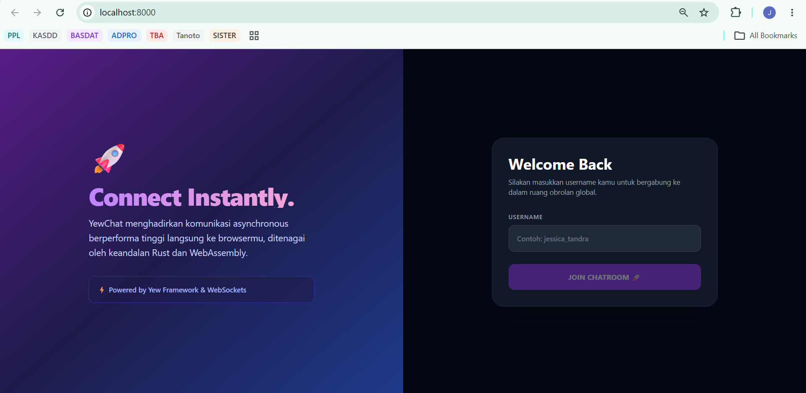
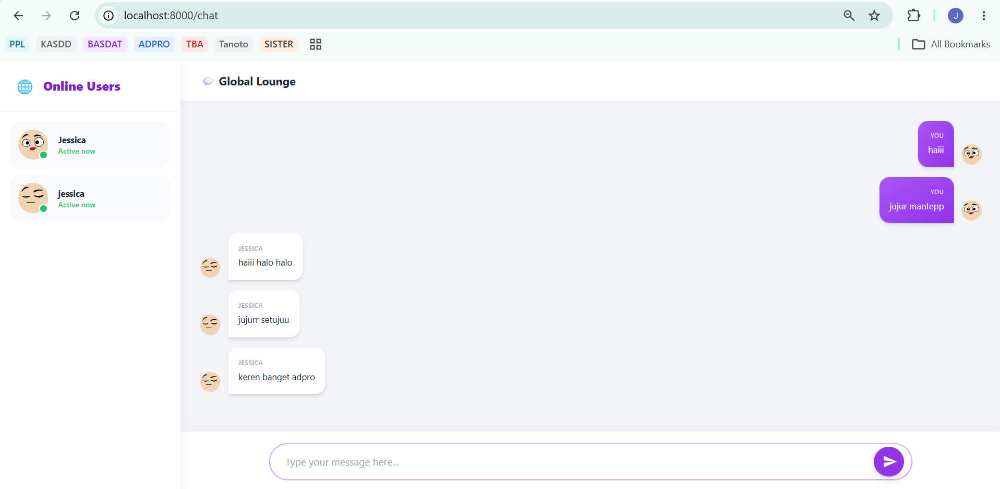

# YewChat 💬
## Experiment 3.1 - Original Code



## Experiment 3.2: Be Creative!

Pada eksperimen ini, saya melakukan perombakan antarmuka (UI) pada web client YewChat. Antarmuka bawaan dari tutorial masih sangat kaku dan kurang mencerminkan aplikasi *chatting* modern, sehingga saya memodifikasinya dengan menerapkan prinsip **User-Centered Design (UCD)**.

Berikut adalah beberapa kreativitas dan modifikasi yang saya tambahkan:

### 1. Modern Split-Screen Login Page
Halaman login dirombak dari *centered-card* biasa menjadi layout *split-screen* (kiri-kanan) untuk layar desktop, yang akan responsif menjadi atas-bawah pada layar mobile. 
- Sisi kiri menampilkan *branding* aplikasi dengan latar belakang gradien yang elegan, penjelasan singkat fitur, dan sentuhan emoji untuk membuatnya lebih ramah. 
- Sisi kanan difokuskan khusus untuk *form* pengisian *username* dengan gaya *input* yang lebih interaktif (shadows, border-focus).



### 2. Pembedaan Chat Bubble (Sender vs Receiver)
Pada antarmuka chat bawaan, pesan dari kita dan orang lain desainnya disamakan (rata kiri semua), yang mana ini sangat membingungkan secara *usability*. Saya mengubah desainnya sesuai standar mental model aplikasi *chatting* saat ini:
- **Pesan dari saya (Current User):** Berada di sisi kanan dengan warna latar belakang gradien ungu.
- **Pesan dari orang lain:** Berada di sisi kiri dengan warna latar belakang putih.
Hal ini dicapai dengan melacak *username* dari `use_context` dan menyimpannya di dalam *state* komponen Chat.



### 3. Visual Hierarchy & Empty State
- **Empty State:** Jika belum ada obrolan sama sekali, layar obrolan tidak akan kosong melompong. Saya menambahkan ilustrasi teks "It's quiet here..." untuk memancing *user* memulai obrolan.
- **Online Users Sidebar:** Daftar pengguna dibuat lebih rapi dengan penambahan indikator "Active now" dan titik hijau untuk menandakan pengguna sedang *online*.
- **Avatar Dinamis:** Saya menggunakan API DiceBear untuk meng-generate avatar unik secara otomatis berdasarkan nama *user*.


## Install

1. Install the required toolchain dependencies:
   ```npm i```

2. Follow the YewChat post!

## Branches

This repository is divided to branches that correspond to the blog post sections:

* main - The starter code.
* routing - The code at the end of the Routing section.
* components-part1 - The code at the end of the Components-Phase 1 section.
* websockets - The code at the end of the Hello Websockets! section.
* components-part2 - The code at the end of the Components-Phase 2 section.
* websockets-part2 - The code at the end of the WebSockets-Phase 2 section.
